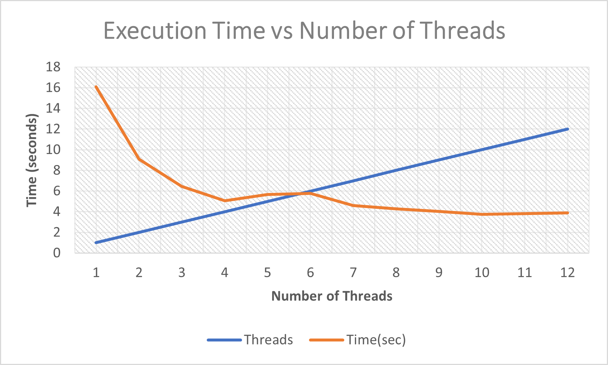
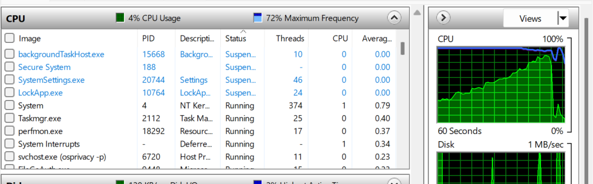

# 🚀 Multithreading Performance Analysis using C++

## 📌 Overview
This project demonstrates the use of multithreading in C++ to optimize matrix multiplication. It analyzes how execution time changes with different numbers of threads and how this relates to CPU cores.

---

## 🎯 Objective
- Implement matrix multiplication using multithreading  
- Compare execution time for different thread counts  
- Identify optimal thread usage  

---

## ⚙️ Methodology
- A constant matrix B is generated once  
- Multiple random matrices A are generated  
- Each A is multiplied with B  
- Work is divided among threads (row-wise)  
- Execution time is recorded for threads from 1 to 12  

---

## 🧵 Multithreading Approach
- Each thread processes a subset of rows  
- Threads run in parallel  
- Synchronization using `join()`  
- Repeated computation simulates real workload  

---

## 📊 Results

| Threads | Time (seconds) |
|--------|----------------|
| 1 | 16.0855 |
| 2 | 9.0761 |
| 3 | 6.45175 |
| 4 | 5.06928 |
| 5 | 5.65618 |
| 6 | 5.76355 |
| 7 | 4.60821 |
| 8 | 4.28391 |
| 9 | 4.01976 |
| 10 | 3.74098 |
| 11 | 3.8142 |
| 12 | 3.89822 |

---

## 📈 Performance Graph



---

## 🖥️ CPU Utilization



---

## 🧠 Key Observations
- Execution time decreases as threads increase  
- Performance improves beyond 6 cores due to workload distribution  
- Best performance observed around 10 threads  
- After that, overhead causes stabilization  

---

## ⚠️ Note
Matrix size and iterations were reduced due to hardware constraints.

---

## 🛠️ Technologies Used
- C++
- Multithreading (`std::thread`)
- MinGW-w64 (GCC 15)
- Excel / Google Sheets  

---

## ▶️ How to Run

```bash
g++ main.cpp -o main -pthread -std=c++11
./main
```

---

## 📂 Project Structure

```
multithreading-assignment/
│
├── main.cpp
├── README.md
├── graph.png
└── cpu_usage.png
```

---

## 💡 Conclusion
Multithreading significantly improves performance, but optimal results depend on balancing threads with system capabilities.

---

## 👨‍💻 Author
Yash Sharma